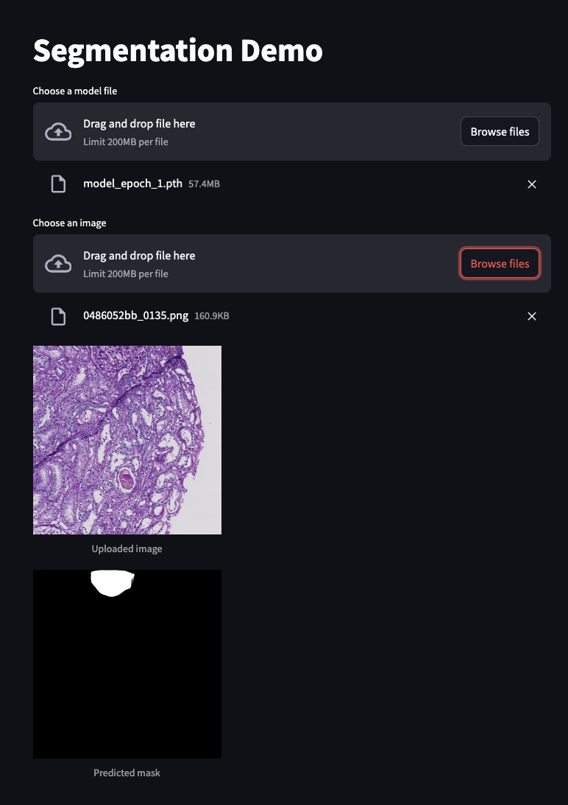

# ai_tartu_2024

### models

there are two models in the project, in the `models` folder.

### images

the images are stored in the `images` folder, which you could use to test the models

### usage on the web

